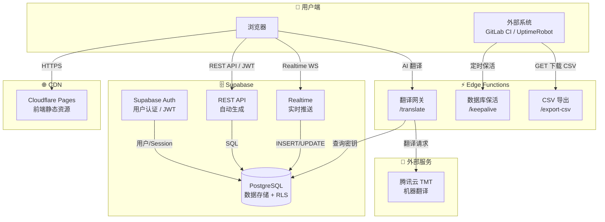

# LangManager - 多语言管理系统

基于 **React + TypeScript + Ant Design + Supabase** 的多语言翻译管理系统，支持多项目管理、在线翻译编辑、批量导出。

## 开源协议

本项目基于 [MIT License](LICENSE) 开源，可自由使用、修改和分发。

## 系统架构



## 功能特性

- **用户认证**：邮箱注册/登录，邮箱找回密码
- **角色体系**：系统角色（超级管理员/系统管理员/运营人员/普通用户）+ 项目角色（管理员/开发者/编辑/查看者）
- **项目管理**：创建多个项目，独立管理各项目的翻译
- **AI 翻译**：集成腾讯云机器翻译 (TMT)，支持单条翻译和批量翻译空值，每月免费 500 万字符
- **翻译编辑**：在线编辑翻译内容，支持多语言对照视图，按语言导出 JSON / 按项目打包 ZIP
- **修改历史**：翻译修改自动记录历史（可按项目开关），支持按 Key 查看所有语言的变更记录；仅超级管理员可查看和清理
- **审计日志**：超级管理员可查看系统审计日志
- **日志管理**：超级管理员可在项目设置中开启/关闭翻译日志，按时间范围（30天/90天）或全部清理历史记录
- **成员管理**：邀请成员加入项目，灵活分配项目角色
- **语言管理**：拖拽排序配置项目语言，支持 15+ 种预设语言快速添加
- **系统设置**：超级管理员可管理系统用户（添加/删除/禁用/启用/重置密码）、分配系统角色、配置翻译服务（腾讯云 SecretId/SecretKey）
- **用户禁用**：管理员可软禁用用户，禁用后立即踢出在线用户、阻止登录、RLS 层面阻断所有数据访问
- **数据与隐私**：用户个人中心，支持查看统计数据、导出/注销个人数据
- **会话安全**：空闲 2 天自动登出，过期前 30 分钟提醒；支持 Refresh Token 自动轮转
- **数据库保活**：内置 keepalive 接口，支持外部定时请求防止数据库休眠

## 技术栈

| 层级 | 技术 |
|------|------|
| 前端框架 | React 18 + TypeScript |
| UI 组件库 | Ant Design 5 |
| 构建工具 | Vite 6 |
| 后端/数据库 | Supabase (PostgreSQL + Auth + RLS) |
| Edge Functions | Supabase Edge Functions (Deno) - 腾讯云 TMT 翻译网关 |
| 拖拽排序 | @dnd-kit |
| 部署 | Cloudflare Pages |

## 快速开始

### 1. 创建 Supabase 项目

1. 前往 [supabase.com](https://supabase.com) 创建项目
2. 在 **SQL Editor** 中执行 `supabase/init.sql` 脚本初始化数据库
3. 在 **Authentication > Providers > Email** 中启用 Email 提供商
4. 部署 Edge Function：`supabase/functions/translate/` 目录下为腾讯云 TMT 翻译网关

```bash
# 使用 Supabase CLI 部署翻译函数
npx supabase functions deploy translate --no-verify-jwt --project-ref <your-project-ref>

# 部署数据库保活函数
npx supabase functions deploy keepalive --no-verify-jwt --project-ref <your-project-ref>
```

> `init.sql` 会自动创建默认管理员账号：`admin@example.com` / `admin123`，请在生产环境中修改密码。

### 2. 配置环境变量

```bash
cp .env.example .env
```

编辑 `.env` 文件，填入你的 Supabase 凭证（在 Supabase Dashboard > Settings > API 中获取）：

```
VITE_SUPABASE_URL=https://your-project.supabase.co
VITE_SUPABASE_ANON_KEY=your-anon-key
```

### 3. 安装依赖并启动

```bash
npm install
npm run dev
```

### 4. 构建生产版本

```bash
npm run build
```

构建产物在 `dist/` 目录。

## 部署到 Cloudflare Pages

### 方式一：连接 Git 仓库

1. 将代码推送到 GitHub
2. 在 Cloudflare Dashboard 创建 Pages 项目
3. 连接 Git 仓库，设置：
   - **Build command**: `npm run build`
   - **Build output directory**: `dist`
   - **Environment variables**: 添加 `VITE_SUPABASE_URL` 和 `VITE_SUPABASE_ANON_KEY`

### 方式二：直接上传

```bash
npm run build
npx wrangler pages deploy dist --project-name=lang-manager
```

## 权限说明

### 系统角色

| 角色 | 说明 |
|------|------|
| 超级管理员 (super_admin) | 拥有系统所有权限，可管理用户和角色 |
| 系统管理员 (sys_admin) | 可管理用户和项目 |
| 运营人员 (operator) | 可管理项目成员，不能管理系统用户 |
| 普通用户 (user) | 基础权限，可创建项目 |

### 项目角色

| 权限 | 管理员 (admin) | 开发者 (developer) | 编辑 (editor) | 查看者 (viewer) |
|------|:---:|:---:|:---:|:---:|
| 查看翻译 | ✅ | ✅ | ✅ | ✅ |
| 编辑翻译值 | ✅ | ✅ | ✅ | ❌ |
| 编辑 Key | ✅ | ✅ | ❌ | ❌ |
| 添加/删除 Key | ✅ | ❌ | ❌ | ❌ |
| 管理语言 | ✅ | ❌ | ❌ | ❌ |
| 管理成员 | ✅ | ❌ | ❌ | ❌ |

> 超级管理员自动拥有所有项目的管理员权限。

## 项目结构

```
src/
├── api/                    # Supabase 客户端
│   └── supabase.ts
├── components/
│   ├── Layout/             # 主布局（侧边栏 + 顶栏）
│   └── ProtectedRoute.tsx  # 路由鉴权
├── contexts/
│   └── AuthContext.tsx      # 认证上下文（登录状态、角色权限）
├── pages/
│   ├── LoginPage.tsx        # 登录
│   ├── RegisterPage.tsx     # 注册
│   ├── ForgotPasswordPage.tsx  # 忘记密码
│   ├── ResetPasswordPage.tsx   # 重置密码
│   ├── ProjectListPage.tsx     # 项目列表
│   ├── ProjectDetailPage.tsx   # 翻译编辑（核心页面，含 AI 翻译）
│   ├── ProjectSettingsPage.tsx # 项目设置（语言/成员管理）
│   ├── SystemSettingsPage.tsx  # 系统设置（用户/角色/翻译服务配置）
│   └── AuditLogPage.tsx        # 审计日志（超级管理员）
├── types/
│   └── index.ts            # 类型定义
├── App.tsx                 # 路由配置
└── main.tsx                # 入口
supabase/
├── init.sql                # 数据库初始化脚本（表/函数/RLS/默认数据）
└── functions/
    ├── translate/
    │   └── index.ts        # 腾讯云 TMT 翻译 Edge Function
    └── keepalive/
        └── index.ts        # 数据库保活 Edge Function
```

## 注意事项

- **第一个注册的用户自动成为超级管理员**（若无管理员账号时）
- 密码重置需要配置 Supabase 的邮件模板和 SMTP（免费版使用自带邮件服务，有每日限额）
- 生产环境务必修改默认管理员密码
- `init.sql` 包含 RLS（Row Level Security）策略，确保数据隔离安全
- 修改历史基于数据库触发器自动记录，需确保 `translation_history` 表和触发器已创建（见 `init.sql`）
- 修改历史和日志管理功能仅对超级管理员开放，各项目可独立控制是否开启日志记录
- AI 翻译依赖腾讯云 TMT 服务，需在系统设置中配置 SecretId 和 SecretKey，并确保已开通机器翻译服务
- 翻译接口部署在 Supabase Edge Functions 上，密钥存储在数据库 `system_configs` 表中
- Supabase 免费版数据库会在 7 天无活动后暂停，可使用 keepalive 接口配合 UptimeRobot 等工具定时保活
